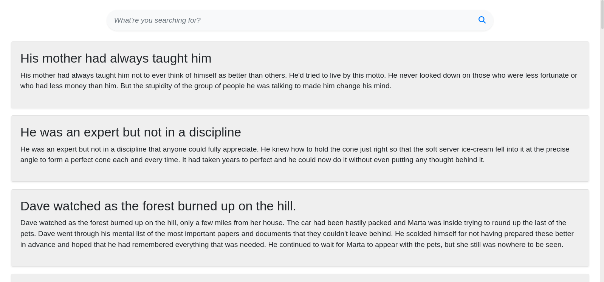

# 🔍 QuickSearch

This Search bar lets you easily search posts using hooks and the filter() function, you can search for specific posts and quickly access the information you need. The posts are dynamically fetched from a REST API using the FetchAPI 🚀
## 🚀 Demo

**Link** : https://shubhdeeprose.github.io/quicksearch

## 📝 Features

- Search Functionality using Hooks and filter()
- Data is dynamically fetched from REST API using FetchAPI 
- Responsive - Bootstrap
- Input is well parsed using string transformations
- Errors are well handled using try catch blocks

## 🧠 Lessons Learned

* React JS
* React FetchAPI
* JS Promises, Async & Await
* React Error Handling & Logging
* React Hooks { useState, useEffect, useRef }
* Higher Order Functions
* Bootstrap
* String Transformations

## 🧩 Tech Stack

![HTML][html-shield] 
![CSS][css-shield] 
![JS][js-shield]
![GITHUB][github-shield]

[html-shield]: https://img.shields.io/badge/HTML5-E34F26?style=for-the-badge&logo=html5&logoColor=white
[css-shield]:https://img.shields.io/badge/Bootstrap-563D7C?style=for-the-badge&logo=bootstrap&logoColor=white
[js-shield]:https://img.shields.io/badge/React-20232A?style=for-the-badge&logo=react&logoColor=61DAFB
[github-shield]:https://img.shields.io/badge/GitHub-100000?style=for-the-badge&logo=github&logoColor=white